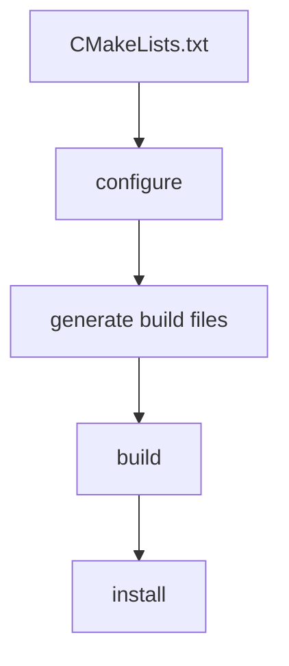

> 这是一篇**排版测试文章（Demo）**，用来一次性检查 Article 页面的完整排版系统。
> 内容以 CMake 为主题，但属于示例性质，不要当作真实技术笔记。

## Introduction

This is a demo article for the `Prose` typesetting system. It exists to exercise
every Markdown element at once: headings, lists, quotes, code, tables, images,
math and diagrams. The prose body sits in a `720px` reading column so long
sessions stay comfortable.

A paragraph can contain **strong emphasis** and *italic emphasis*, plus an
inline reference such as `target_link_libraries`. Mixed 中文英文混排 should also
read cleanly without breaking the line rhythm.

### Why this page exists

The goal is a reading experience built from size, spacing and gray value — not
from bold weights or color. Nothing here goes above `font-weight: 500`.

## Architecture

CMake models a build as a graph of **targets**. Each target carries its own
properties, and dependencies are expressed through *visibility* specifiers.

1. Write a `CMakeLists.txt` at the project root.
2. Declare targets with `add_executable` or `add_library`.
3. Wire dependencies with the `*_libraries` / `*_directories` commands.

- Public visibility: propagates to consumers.
- Private visibility: stays internal to the target.
- Interface visibility: headers only, no implementation.

> Build systems reward reading over fighting. A clean target graph is easier to
> reason about than a long list of global compiler flags.

## Implementation

A minimal executable target looks like the following C++ snippet, wrapped by a
small `CMakeLists.txt`.

```cpp
#include <iostream>

int main() {
  // A trivial program — the point is the surrounding build file.
  std::cout << "hello from a cmake target\n";
  return 0;
}
```

```cmake
cmake_minimum_required(VERSION 3.16)
project(demo LANGUAGES CXX)

add_executable(demo main.cpp)

# PUBLIC means consumers also get these flags.
target_compile_features(demo PUBLIC cxx_std_17)
```

Configure and build from the command line:

```bash
cmake -S . -B build -DCMAKE_BUILD_TYPE=Release
cmake --build build --parallel
./build/demo
```

Other languages render through the same monochrome highlighter:

```python
def configure(features):
    return [f"-DCMAKE_CXX_STANDARD={f}" for f in features]
```

```json
{
  "name": "demo",
  "version": "0.1.0",
  "compiler": { "cxx": "17", "warnings": "all" }
}
```

```yaml
project:
  name: demo
  std: 17
targets:
  - demo:
      kind: executable
      sources: [main.cpp]
```

### A reference table

The visibility specifiers map onto propagation rules:

| Specifier | Propagates to consumers | Carries usage requirements |
| --------- | ---------------------- | ------------------------- |
| PUBLIC    | Yes                    | Yes                       |
| PRIVATE   | No                     | No                        |
| INTERFACE | Yes                    | Yes, no build             |

### An image

Markdown images keep a hairline border and a small radius — no heavy shadow,
no oversized rounding.


### A diagram

Mermaid renders into the same grayscale palette as the rest of the site, and
re-themes when you switch light / dark.



## Math

Inline math such as $E = mc^2$ sits on the text baseline, while display math
breaks onto its own centered line:

$$
y = wx + b
$$

A slightly larger expression:

$$
\sum_{i=1}^{n} (x_i - \bar{x})^2 = \sum_{i=1}^{n} x_i^2 - n\bar{x}^2
$$

## Conclusion

If every element above renders with the same quiet hierarchy — gray steps, no
accent color, no shadows — the typesetting system is doing its job.
